```{r child = "setup.Rmd"}
```

```{r xaringan-tile-view, echo=FALSE}
xaringanExtra::use_tile_view()
```

```{r xaringan-editable, echo=FALSE}
xaringanExtra::use_editable(expires = 1)
```

```{r xaringanExtra-clipboard, echo=FALSE}
htmltools::tagList(
  xaringanExtra::use_clipboard(
    button_text = "<i class=\"fa fa-clipboard\"></i>",
    success_text = "<i class=\"fa fa-check\" style=\"color: #90BE6D\"></i>",
    error_text = "<i class=\"fa fa-times-circle\" style=\"color: #F94144\"></i>"
  ),
  rmarkdown::html_dependency_font_awesome()
)
```

```{r xaringan-fit-screen, echo=FALSE}
xaringanExtra::use_fit_screen()
```

```{r xaringan-extra-styles, echo=FALSE}
xaringanExtra::use_extra_styles(
  hover_code_line = TRUE,         #<<
  mute_unhighlighted_code = TRUE  #<<
)
```

```{r xaringan-scribble, echo=FALSE}
xaringanExtra::use_scribble()
```

# Exemplo: Produção de Sanduíche Vegetariano

.pull-left[
## Lista de ingredientes

- **3** folhas de alface (A)
- **4** fatias de Tomate (T)
- **2** pães de forma (P)
]

.pull-right[
## Informação adicional

- 1 pé de alface tem aproximadamente **15 folhas**
- 1 tomate tem **8 fatias**
]

---

# MRP - Material Requirements Planning

### O que é?

**Planejamento das necessidades de materiais (MRP)** é um sistema de informações computadorizado desenvolvido especificamente para ajudar os fabricantes a administrar o estoque e a programação de pedidos de reposição.

Sistema que estabelece uma série de procedimentos e regras de decisão, de modo a atender às necessidades de produção numa sequência de tempo logicamente determinada para cada item componente do produto final.

Sistema MRP lida com suprimentos de peças e componentes cujas demandas **dependem** de determinado produto final.

---

# Objetivos do MRP

Os principais objetivos são:


1. **Garantir a disponibilidade** de materiais, componentes e produtos para atendimento ao planejamento da produção e às entregas aos clientes.

2. **Manter os inventários** no nível mais baixo possível.

3. **Planejar atividades** de manufatura, de suprimento e de programação de entregas.


---

# Sistema MRP - Ideia Básica

.pull-left[

## Ponto de Partida

O processo inicia-se a partir da informação de:
- **"QUANDO"** o cliente deseja consumir
- **"QUANTO"** o cliente deseja consumir
]

.pull-right[

## Explosão de Materiais

O MRP, então, **"explode"** essas informações para cada item componente do produto final.
]

---

# Sistema MRP - Principais Componentes

**1. Programa-mestre de produção (MPS)**
- Declaração de tudo o que a empresa irá produzir
- Utiliza pedidos em carteira + previsão de demanda

**2. Lista de materiais (BOM - Bill of Materials)**
- Quantidade exata de matérias-prima, componentes e sub-rotinas

**3. Registros de inventário**
- Nível de estoque e pedidos em aberto
- Estoques mínimos e lead times


---

# Sistema MRP - Principais Componentes (cont.)
 
**4. Programa MRP**
- Transforma a demanda do produto final em necessidades brutas para cada item componente

**5. Relatórios e dados de saída**


---

# Estrutura hierárquica de componentes

Produto Final → Subconjuntos → Componentes → Matéria-prima

```{r echo=FALSE, fig.align='center', message=FALSE, warning=FALSE, out.width='70%'}
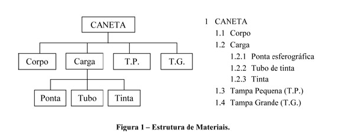
```

---

# Estrutura hierárquica de componentes

Gestão de estoques a partir de uma lista de materiais (BOM): O caso de um hospital público universitário

```{r echo=FALSE, fig.align='center', message=FALSE, warning=FALSE, out.width='70%'}
knitr::include_graphics("img/bom.png")
```

---

# Cálculo das necessidades de materiais

O cálculo das necessidades de materiais depende de vários fatores:

- Estrutura do produto com os níveis de fabricação.
- Tamanho dos lotes de pedidos.
- Tempos de reposição para cada item componente, seja ele comprado ou fabricado ou montado internamente.

Uso de cada peça, levando em consideração que   
▶ ela pode ser usada também em outros produtos   
▶ ela pode ser usada no mesmo produto, só que em diversos níveis


---

# Cálculo das Necessidades - Nomenclatura

## Representação da estrutura do produto em árvore

**Descendência na árvore:**
- Um item é **item pai** de seus componentes imediatos
- Um item é **item filho** do item do qual ele é componente
- Toda liberação de pedido programada de um item pai gera uma necessidade bruta de seus itens filhos

---

# Cálculo das Necessidades - Nomenclatura

## Representação da estrutura do produto em árvore

**Nível ou código de subitem:**
- Toda peça possui um código de subitem
- Cálculo das necessidades de materiais é feito em ordem crescente de nível
- Produtos que não é subitem de outro, possui código de subitem 0
- Demais itens possuem como código de subitem o nível mais baixo da estrutura de produtos considerando todos os produtos dos quais ele é componente


---

# Exemplo 1

A empresa Adirex SA, produz um tipo de produto (A), com uma estrutura de montagem dada pela seguinte rede de materiais:


```{r echo=FALSE, fig.align='center', message=FALSE, warning=FALSE, out.width='30%'}
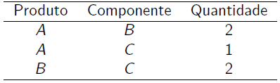
```

As informações de inventários são:


```{r echo=FALSE, fig.align='center', message=FALSE, warning=FALSE, out.width='50%'}
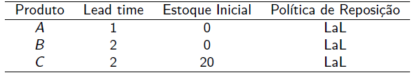
```

.midi[
A empresa necessita entregar 20 unidades do produto A na sexta semana. Determine a quantidade a encomendar dos produtos/componentes e os períodos em que devem ser efetuadas as encomendas.
]
---

# Exemplo 1 - MRP do Produto A

.large[
```{r echo=FALSE, message=FALSE, warning=FALSE}
mrp_a <- data.frame(Semana = 1:6, "Nec. Bruta" = c("", "", "", "", "", "20"), "Est. Proj." = c("0", "0", "0", "0", "0", "0"), "Rec. plan." = c("", "", "", "", "", "20"), "Lib. de ped." = c("", "", "", "", "20", "") )

kable(mrp_a, align = 'c', format = 'html', col.names = c("Semana", "Nec. Bruta", "Est. Proj.", "Rec. plan.", "Lib. de ped.")) %>% 
  kable_styling(bootstrap_options = c("striped", "hover"), full_width = TRUE, font_size = 30)

```
]
.footnote[
Lead time = 1 semana | Estoque inicial = 0 | Política: LaL
]

---

# Exemplo 2 - Contexto

A **J.C. Móveis** fabrica dois tipos de armários para cozinha: **Modelo A** e **Modelo B**.

Jorge, seu dono, planeja montar:
- **10 armários** do modelo A → entrega no **período 4**
- **5 armários** do modelo B → entrega no **período 5**

---

# Exemplo 2 - Contexto

## Lead times

- Modelos A e B: **1 período**
- Componentes X, Z, T e R: **1, 2, 1 e 1 período**, respectivamente
- Estoque de segurança: **nulo** para todos os produtos e componentes.

## Política

Reposição **lote a lote**

---

# Exemplo 2 - Diagramas de cada produto


```{r echo=FALSE, fig.align='center', message=FALSE, warning=FALSE, out.width='100%'}
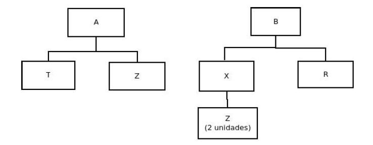
```

---

# Exemplo 2 - Diagramas de cada produto


```{r echo=FALSE, fig.align='center', message=FALSE, warning=FALSE, out.width='80%'}
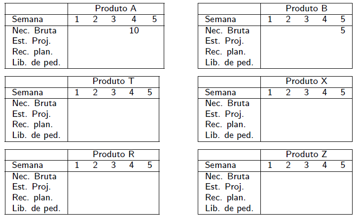
```


---

# Exemplo 2 - Diagramas de cada produto


```{r echo=FALSE, fig.align='center', message=FALSE, warning=FALSE, out.width='80%'}
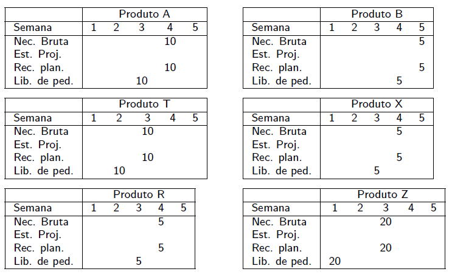
```

---

# Exemplo 3 - Dados

A J.C. Móveis fabrica dois tipos de armários para cozinha, cujas necessidades brutas são:

- Armário do modelo A: 25 unidades no período 5 e 30 unidades no período 6. 
- Armário do modelo B: 35 unidades no período 7.

Dados de inventário:

```{r echo=FALSE, fig.align='center', message=FALSE, warning=FALSE, out.width='80%'}
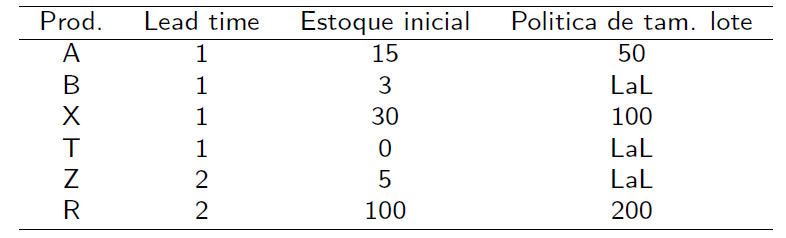
```

---

# Exemplo 3 - Dados

Estrutura de montagem:

```{r echo=FALSE, fig.align='center', message=FALSE, warning=FALSE, out.width='80%'}
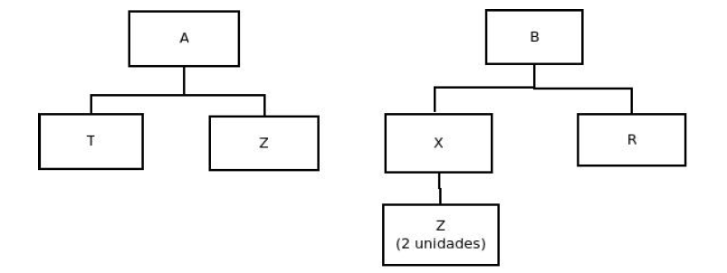
```

---

# Exemplo 3 - Solução

```{r echo=FALSE, fig.align='center', message=FALSE, warning=FALSE, out.width='100%'}
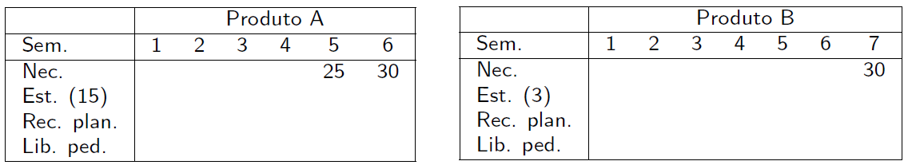
```

```{r echo=FALSE, fig.align='center', message=FALSE, warning=FALSE, out.width='100%'}
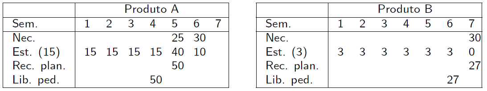
```

---

# Exemplo 3 - Solução

```{r echo=FALSE, fig.align='center', message=FALSE, warning=FALSE, out.width='100%'}

```

```{r echo=FALSE, fig.align='center', message=FALSE, warning=FALSE, out.width='100%'}
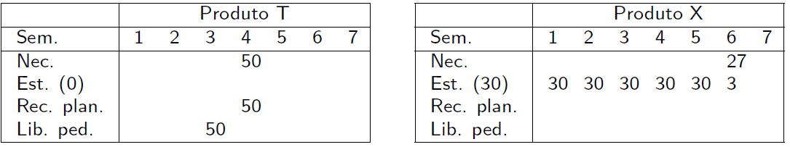
```

---

# Exemplo 3 - Solução

```{r echo=FALSE, fig.align='center', message=FALSE, warning=FALSE, out.width='100%'}
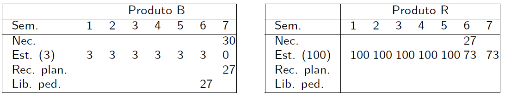
```

---

# Exemplo 3 - Solução

```{r echo=FALSE, fig.align='center', message=FALSE, warning=FALSE, out.width='100%'}

```

```{r echo=FALSE, fig.align='center', message=FALSE, warning=FALSE, out.width='50%'}
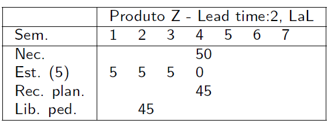
```

---

# Os Problemas do MRP

## Principais Desafios

1. **Incertezas** (lead time e quantidade)

2. **Lead time fixo**

3. **Inviabilidade da capacidade**

4. **Nervosismo do sistema**


---

# Estoque de Segurança - Exemplo Sem ES

## Dados
- Lotes fixos: **50 unidades**
- Lead time: **1 período**
- Estoque de segurança: **0**

```{r echo=FALSE, fig.align='center', message=FALSE, warning=FALSE, out.width='60%'}
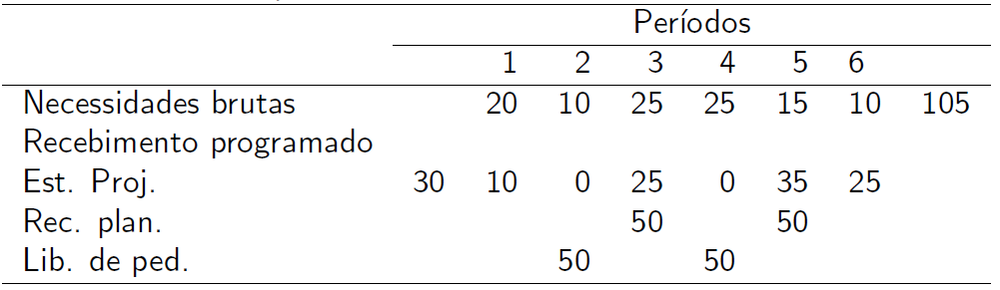
```

⚠️ Períodos 3 e 5: Estoque zerado - risco de falta!

---

# Estoque de Segurança - Exemplo Com ES

## Dados
- Lotes fixos: **50 unidades**
- Lead time: **1 período**
- Estoque de segurança: **10 unidades**

```{r echo=FALSE, fig.align='center', message=FALSE, warning=FALSE, out.width='60%'}
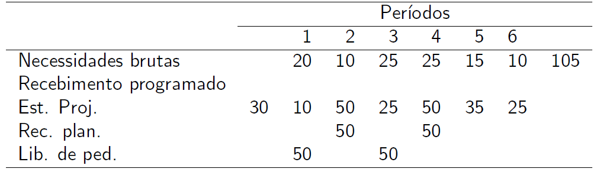
```
✓ Estoque sempre acima do mínimo de segurança


---

# MRPII - Planejamento dos Recursos de Manufatura

## O que é MRPII?

**MRPII** (Manufacturing Resources Planning) é uma evolução do MRP que, além de considerar as necessidades de materiais, considera também necessidades de outros recursos como mão de obra, equipamentos, espaços para armazenagem, instalações, capacidade produtiva, recursos financeiros.

## Módulos

.midi[
1. Planejamento da produção   
2. Planejamento-mestre de produção (PMP ou MPS)   
3. Cálculo das necessidades de materiais (MRP)   
4. Cálculo das necessidades de capacidade (CRP)   
5. Controle do chão de fábrica (SFC - Shop Floor Control)   
]

---

# Exemplo MRPII - Dados

Elaborar os cálculos das necessidades de materiais e de capacidade. Em cada semana há seis funcionários que trabalham 40h com possível extensão de até 10 horas. Caso não seja possível, ajuste o plano de produção. Considere que os todos os funcionários são capacitados para produzir os itens A e C.

```{r echo=FALSE, fig.align='center', message=FALSE, warning=FALSE, out.width='75%'}
knitr::include_graphics("img/mrp2_1.png")
```

---

# Exemplo MRPII - Dados

## Capacidade Disponível

- **Capacidade hora normal**: 240 horas (6 funcionários × 40h)
- **Capacidade hora extra**: 60 horas (até 10h extras)


```{r echo=FALSE, fig.align='center', message=FALSE, warning=FALSE, out.width='70%'}
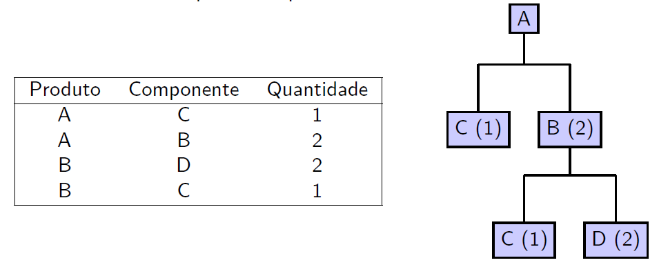
```

---

# Exemplo MRPII - Solução

## Cálculo das necessidades de capacidade

```{r echo=FALSE, fig.align='center', message=FALSE, warning=FALSE, out.width='70%'}
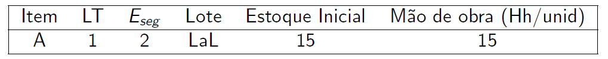
```

```{r echo=FALSE, fig.align='center', message=FALSE, warning=FALSE, out.width='70%'}
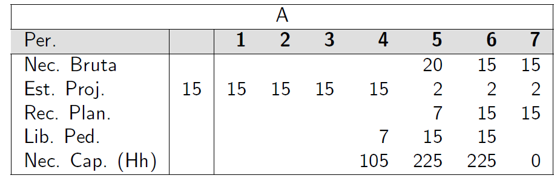
```

---

# Exemplo MRPII - Solução

## Cálculo das necessidades de capacidade

```{r echo=FALSE, fig.align='center', message=FALSE, warning=FALSE, out.width='50%'}
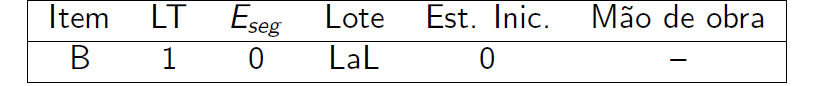
```

```{r echo=FALSE, fig.align='center', message=FALSE, warning=FALSE, out.width='50%'}
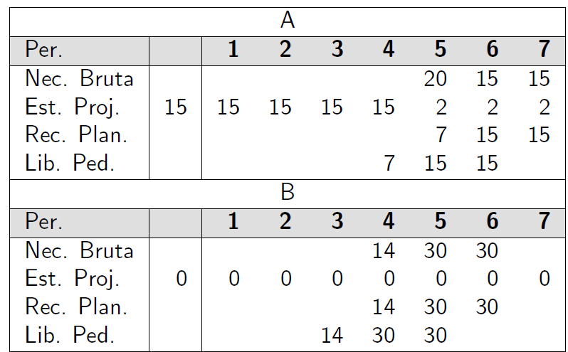
```

---

# Exemplo MRPII - Solução

## Cálculo das necessidades de capacidade

```{r echo=FALSE, fig.align='center', message=FALSE, warning=FALSE, out.width='60%'}
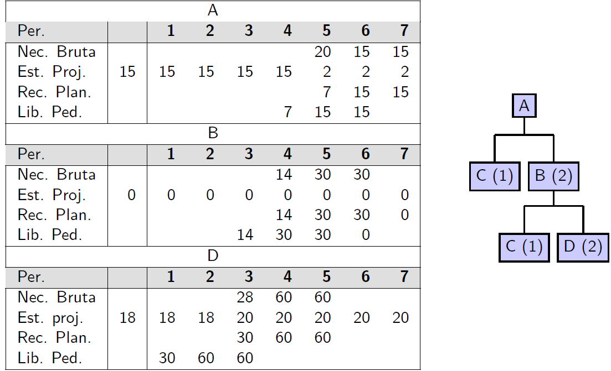
```

---

# Exemplo MRPII - Solução

## Cálculo das necessidades de capacidade

```{r echo=FALSE, fig.align='center', message=FALSE, warning=FALSE, out.width='60%'}
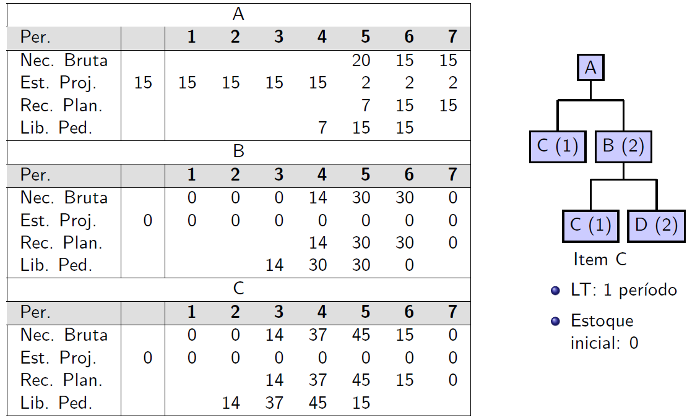
```

---

# Exemplo MRPII - Solução

## Cálculo das necessidades de capacidade

```{r echo=FALSE, fig.align='center', message=FALSE, warning=FALSE, out.width='60%'}
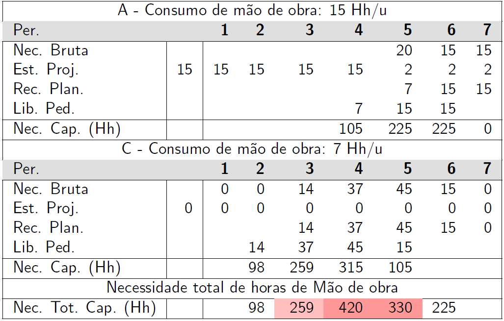
```

---

# Referências

**Principais:**

- CORRÊA, H. L.; CORRÊA, C. A. **Administração de produção e operações**: manufatura e serviços. 3. ed. São Paulo: Atlas, 2012.

- SLACK, N.; BRANDON-JONES, A.; JOHNSTON, R. **Administração da produção**. 8. ed. São Paulo: Atlas, 2018.

**Complementares:**

- VOLLMANN, T. E. et al. **Manufacturing planning and control systems**. 5th ed. McGraw-Hill, 2005.

- LUSTOSA, L. et al. **Planejamento e controle da produção**. Rio de Janeiro: Elsevier, 2008.


---
class: center, middle

.huge[
**DÚVIDAS?**
]


